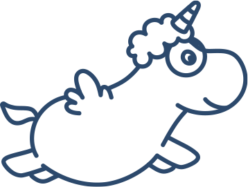

<!-- Top Banner -->

    

<h1 align="center"><i>Hi, I’m Eva Anna</i></h1>

I’m a <b>Full-Stack Developer & Creative Technologist</b> based in Switzerland.  
I combine <b>10+ years of global design leadership</b> with software engineering at
<a href="https://42lausanne.ch"><b>42 Lausanne</b></a>, continuing full-stack training with an <b>AI specialization</b>.

 

<!-- Wave divider -->

  

<h2 align="center"><i>🎯 What I’m working on right now</i></h2>

- 🚀 Building full-stack digital experiences with <b>Next.js + GSAP</b> — crafted with <b>UX, UI, and branding psychology</b> to be result-driven  
- 🤖 Exploring <b>AI-enhanced user experiences</b> with <b>PyTorch</b> & real-time architectures  

<h2 align="center"><i>🛠 Tech & Tools</i></h2>

<b>Languages & Backend</b> 
<code>C</code> <code>C++</code> <code>Python</code> <code>JavaScript</code>  
<code>Node.js</code> <code>Fastify</code> <code>ExpressJS</code> <code>Flask</code> <code>Docker</code>

  

<b>Frontend & Creative Coding</b> 
<code>React</code> <code>React Native</code> <code>Next.js</code> <code>GSAP</code> <code>TailwindCSS</code> <code>AngularJS</code> <code>TypeScript</code>

  

<b>AI & Systems — Core</b> 
<code>PyTorch</code> <code>TensorFlow</code> <code>LangChain</code> 
<code>RAG pipelines</code> <code>Deep Q-Learning</code> <code>System Programming (C/C++)</code> 
<code>Evolutionary Algorithms (NEAT)</code> <code>Tensors</code> <code>Real-time Architectures (WebSockets, multiplayer)</code>

  

<b>AI & Systems — Explored</b> 
<code>Vector Search (FAISS, Chroma)</code> <code>Ollama</code> <code>Flowise</code>

 <b>Deployment & Cloud</b> 
<code>Google Cloud Run</code> <code>Docker</code> <code>CI/CD (GitHub Actions)</code>

<h2 align="center"><i>📚 Background</i></h2>

- 🎓 <b>42 Lausanne (2023– )</b> — Full-stack development & AI specialization  
- 🎓 <b>2× M.A. in Design</b> — Graphic Moving Image (University of the Arts UAL London) & Industrial Design & Visual Communication (Academy of Fine Arts & Design Wrocław)  
- 💼 <b>10 years in design industry</b> — Sr Designer / Art Director / Creative for adidas, TeamNL, Mercedes, McDonald’s, Unilever, Magnum, Knorr, and more

<h2 align="center"><i>📜 Certificates</i></h2>

<h2 align="center"><i>📜 Certificates</i></h2>

  
<i>Foundations of User Experience (UX) Design</i> — <b>Grade: 91.6%</b>  

  

  
<i>Introduction to Deep Learning & Neural Networks with Keras</i> — <b>Grade: 85%</b>  

  

  
<i>Simple Linear Regression for the Absolute Beginner</i> — <b>Grade: 100%</b>  

<h2 align="center"><i>🌍 Languages</i></h2>

Polish — Native • English — C2 (primary working language) • German — B2 (improving) •  
Dutch — B1 (conversational) • French — A2 (learning)

✨ <i>I design and code with users in focus — merging logic, creativity, technology and a bit of magic into solutions that are elegant and effective.</i>

